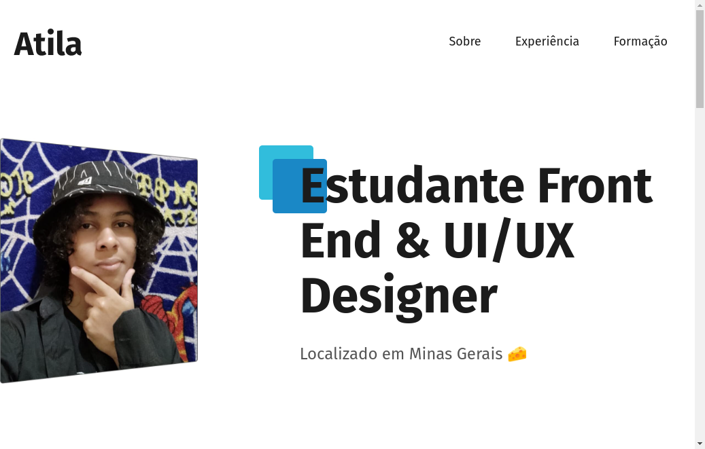

<h1  align="center">Currículo</h1>

Projeto desenvolvido com as minhas informações de currículo! com os cursos da Origamid!

 

## Tecnologias! 🚀 
- HTML
- CSS

## Sobre 
nesse projeto desenvolvi o design e o HTML e CSS do projeto final. Aprendi e consolidei minhas skills front-end, sentido que finalmente tenho esses fundamentos sólidos de verdade, fora a experiencia nova de UI Design.

